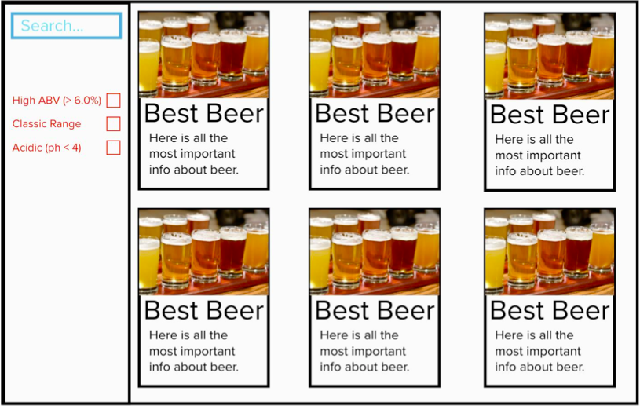

# **Brewdog API App**

---

### **Description**

This is a React built App. It displays Brewdog beers, each beer has a: name, image, ABV and tagline. Data has been taken from the [Punk API](https://api.punkapi.com/v2/beers "Link to API"), which contained the beer data used for the app. Where possible the App has been unit tested.

What I learnt from this project: the use of components and containers in practice, use of state, working with data from APIs

Link to the [App](https://obuckland.github.io/brewdog/ "Link to App").

---

| **Table of contents** |
| --------------------- |
| Technology            |
| Design                |
| Functionality         |
| Further development   |
| Images/Demos                |
| Links                 |

### **Technology**

- React
- HTML
- CSS
- SCSS
- Git & GitHub

### **Design**

This is the image specification for the project:

Colours chosen using the [Coolors](https://coolors.co/ "Link to Coolors website") webside. App is responsive to device size.

### **Functionality**

There are four choices for the user when searching for a specific beer/ filtering out unwanted beers.
The user can search for a specific beer using the search bar. There are 3 filter buttons to narrow the results. Along with a reset button, to clear the searched/filtered fields.

Development of the project:
Currently the user can only use one search field at a time, given more time I would like to develop this so that multiple fields can be used at once.

### **Images/Demos**

### **Links**

[GitHub repository](https://github.com/OBuckland/brewdog "Link to GitHub")

[Use the App](https://obuckland.github.io/brewdog/ "Link to App")
