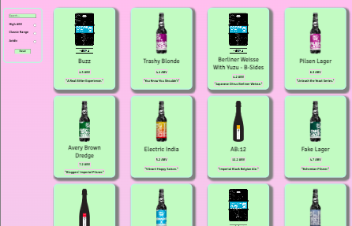
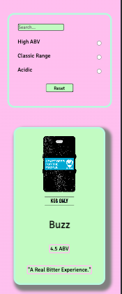

# **Brewdog API App**

---

### **Description**

This is a React built App. It displays Brewdog beers, each beer has a: name, image, ABV and tagline.

Data has been taken from the Punk API, which contained the beer data used for the app.

Where possible the App has been unit tested.

What I learnt - use of components and containers in practice, use of state, working wil data from APIs

Improve - more responsive to different screen sizes, ability to filter multiple filters at once.

from a database hosted at:
https://api.punkapi.com/v2/beers

Built using React, HTML, CSS and SCSS. Link to the [game](obuckland.github.io/mastermind-game/).

---

| **Table of contents** |
| --------------------- |
| Technology            |
| Design                |
| Functionality         |

Requirements
| Unit testing  
Fruther development |
| Images |
| Links |

### **Technology**

- React
- HTML
- CSS
- SCSS
- Git & GitHub

### **Design**

used coolers
simple
easy to use

<!-- *   Designed using figma
*   Modelled on the original Mastermind board game
*   Built using a mobile first approach
*   Responsive to device size -->

### **Design**

• Built entirely in React
• Use the Punk API (after using the data file first) (https://punkapi.com/)
• Unit test where possible
• Repository on GitHub

### **Functionality**

There are four choices for the user when searching for a specific beer/ filtering out unwanted beers.
The user can search for a specific beer using the search bar. There are 3 filter buttons to narrow the results. Along with a reset button, to clear the searched/filtered fields.

Development of the project:
Currently you cn only use one search field at a time, given more time I would like to develop this so that multiple fields can be used at once.

### **Images**

### **Links**

[GitHub repository](https://github.com/OBuckland/brewdog "Link to GitHub")

[Use the App]( "Link to Game")
